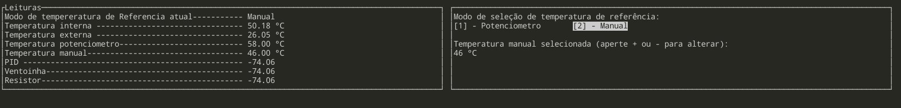
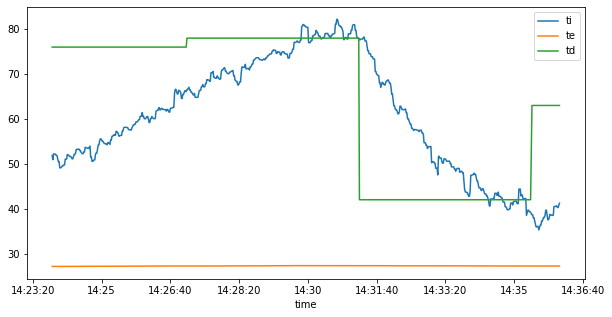
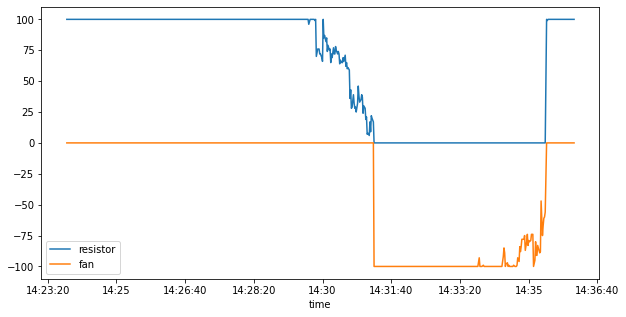

## Projeto 1 - 2020/2 - FSE

__Aluno__: Elias Bernardo Marques Magalhães
__Matrícula__: 150/009011

Este trabalho tem por objetivo a implementação do controle de temperatura de um sistema que possui internamente dois dispositivos para alterar sua temperatura. O primeiro é um resistor de potência de 15 Watts utilziado para aumentar temperatura e o segundo, uma ventoinha que puxa o ar externo (à temperatura ambiente) para reduzir a temperatura.

## Compilação e utilização

> Toda a compilação e utilização foi testada na Raspberry via ssh.

### Compilação

Para compilar o trabalho, digite 

    make all

Em um terminal e aguarde a compilação. Assim que ela finalizar, rode o comando

    make run

E siga as instruções de uso.
> Se, por algum motivo o comando make run não funcionar, você pode digitar `./bin/bin` como alternativa.

### Utilização

A utiização do projeto é relativamente simples. Ele possui uma interface criada utilizando a biblioteca __ncurses__:

O menu possui duas áreas: a parte de leitura (e recebimento) dos dados e o menu de operações. 

É possível alterar a seleção da temperatura de referência para ser utilizada via valor lido do potenciômetro (opção padrão) ou manualmente. Para alterar entre as opções apenas tecle os números __1 (leitura via potênciometro)__ ou __2 (referência manual)__. __NÃO__ é necessário apertar enter; simplesmente apertar 1 ou 2 já alterna a opção automaticamente.

Para alterar a temperatura de referência é necessário apertar a tecla __+ para aumentá-la__ e __- para diminuí-la__. O valor padrão é de 35º, que pode ser ajustado a qualquer momento. 

> Os limites para a tempetatura manual são >= TE && < 100.

Durante a execução do programa, um arquivo de logs no formato CSV é atualizado automaticamente. Não é preciso criar esse arquivo, pois o programa o cria caso ele não exista 

> O CSV fica na pasta raiz, nomeado como __data.csv__

Para encerrar o programa, apenas aperte __ctrl+c__. O programa irá capturar o sinal sigint e fechar algumas conexões, desligar o resistor e a ventoínha além de cancelar a trhead do menu.

## Resultado do experimento

O resultado do experimento pode ser visualizado nos gráficos abaixo:
Legendas: 

- ti = __Temperatura interna__, em ºC;
- te = __Temperatura externa__, em ºC;
- td = __Temperatura definida pelo usuário__ (potenciômetro ou manual), em ºC;
- fan = Valor de acionamento da __ventoínha__, em percentagem;
- resistor = Valor de acionamento do __resistor__, em percentagem.

Temperaturas vs tempo (onde td veio do potenciômetro nesse gráfico):

Resistor & ventoínha vs tempo

